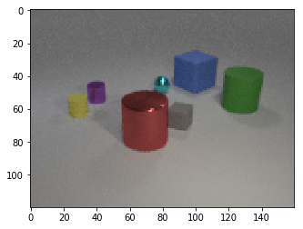
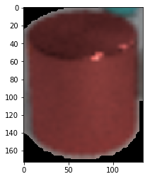
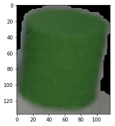
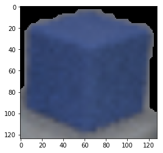
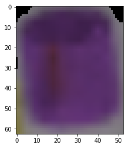
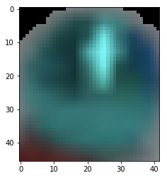
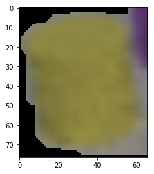
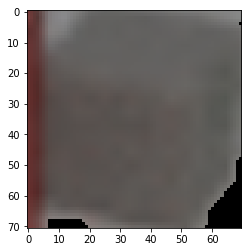

# CLEVR_VQA

## Current status: 
1. Object detection achieved.
  Issues to be adressed:
    1. Detect objects separately when they are of the same color and are very close to one another.
2. Deep learning module being built.

## Current results:

### Image:

### Objects:

